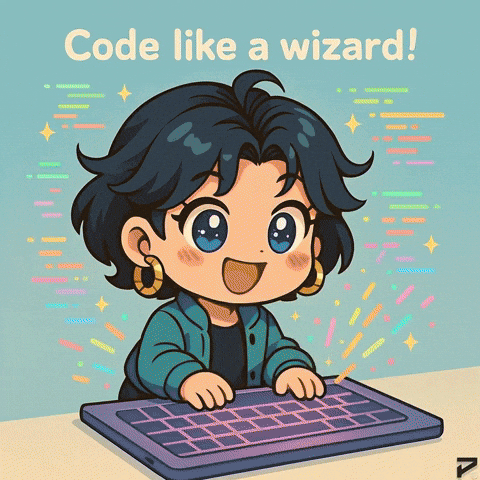
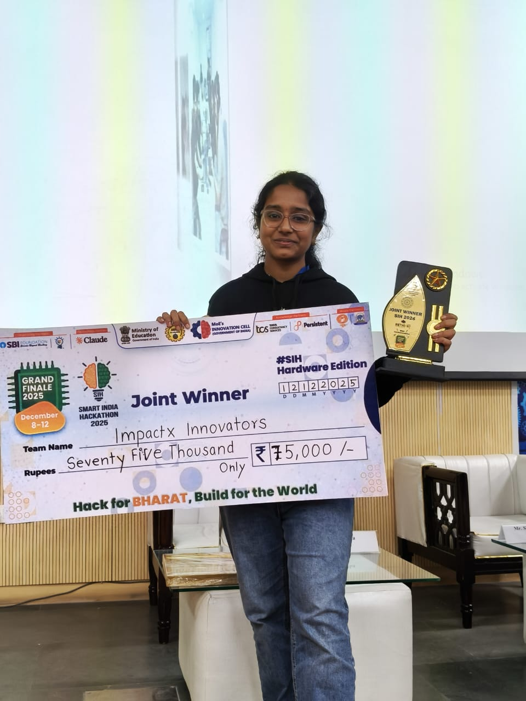
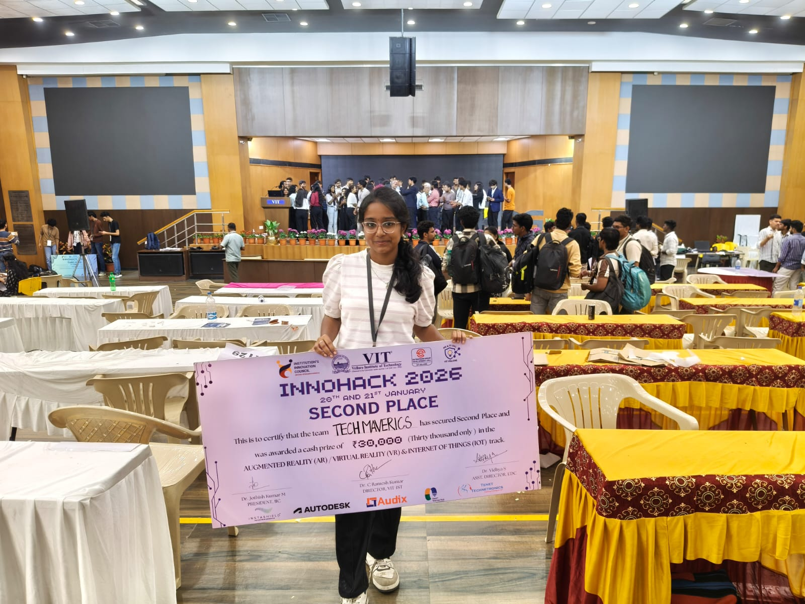

<p align="center">
  <code>
██╗  ██╗██╗██████╗ ██╗   ██╗████████╗██╗ ██████╗  █████╗  █████╗ 
██║ ██╔╝██║██╔══██╗██║   ██║╚══██╔══╝██║██╔════╝ ██╔══██╗██╔══██╗
█████╔╝ ██║██████╔╝██║   ██║   ██║   ██║██║  ███╗███████║███████║
██╔═██╗ ██║██╔══██╗██║   ██║   ██║   ██║██║   ██║██╔══██║██╔══██║
██║  ██╗██║██║  ██║╚██████╔╝   ██║   ██║╚██████╔╝██║  ██║██║  ██║
╚═╝  ╚═╝╚═╝╚═╝  ╚═╝ ╚═════╝    ╚═╝   ╚═╝ ╚═════╝ ╚═╝  ╚═╝╚═╝  ╚═╝
  </code>
</p>
<p align="center">
  <strong>✨ AI Product Engineer • Full-Stack Builder • Targeting 🎯 ZOHO •  ✨</strong>
</p>

<div align="center">
  
</div>

<br/>

<div align="center">

<!-- Animated Typing SVG -->
<a href="https://github.com/Krithiikaa">
  
</a>

<!-- Professional Role Tags -->


<br/><br/>

<!-- Social Links -->
<a href="https://www.linkedin.com/in/krithikaa-rajkumaar/">
  
</a>
<a href="https://github.com/Krithiikaa?tab=repositories">
  
</a>
<a href="https://github.com/Krithiikaa?tab=followers">
  
</a>


</div>

<br/>

<!-- Elegant Divider -->


<br/>

##  &nbsp;Who Am I?

<table>
<tr>
<td width="50%">

### 💫 The Short Version

> *🚀 Computer Science Engineer by skill, builder by mindset.*
> 
> *👩💻⚡ A tech-driven woman shaping systems with precision and purpose. ⚙️✨*

I design and build **real-world inspired dashboards, system interfaces, and intelligent web applications** that sit at the intersection of **UI, data, and engineering**.

My work focuses on **real-time visualization**, **simulations**, **AI-assisted tools**, and **problem-driven design** — translating complex ideas into clear, usable systems while continuously learning and iterating.

### 🔭 Currently
- Building **interactive dashboards** & **Python tools**
- Developing **full-stack apps** with React + Node.js
- Working on **IBM SkillsBuild** internship projects

### 🌱 Learning
- Advanced **JavaScript** & **TypeScript**
- Real-time **Web APIs** & **Socket.IO**
- **AI/ML** integration in web systems

### 💡 Philosophy
```
"Code with purpose, design with empathy."
```

</td>
<td width="50%">

```js
// 🧬 kiruthigaa.config.js

const Krithiikaa = {
  
  fullName: "Kiruthigaa K",
  handle:   "@Krithiikaa",
  location: "📍 Kanchipuram, India",
  degree:   "B.E. Computer Science Engineering",
  
  superpower: "Turning complex data into 
               beautiful, usable interfaces",
  
  domains: [
    "🖥️  Real-Time Dashboard Systems",
    "⚛️  Full-Stack Web Applications", 
    "🤖  AI-Assisted Tools & Pipelines",
    "🎨  UI/UX & Interface Design",
    "📊  Data Visualization",
    "🔧  System Simulations"
  ],
  
  currentlyExcitedAbout: [
    "GenAI-powered applications",
    "WebSocket real-time systems",
    "Interactive data dashboards",
    "Open-source contributions"
  ],
  
  motto: "Build things that matter. ✨"
};

export default Krithiikaa;
```

</td>
</tr>
</table>

<br/>

<!-- Elegant Divider -->


<br/>

##  &nbsp;Tech Stack & Tools

<div align="center">

<!-- Languages -->
<table>
<tr>
<td align="center" width="100%">
<h3>⚡ Languages I Speak</h3>
</td>
</tr>
<tr>
<td align="center">


</td>
</tr>
</table>

<table>
<tr>
<td align="center" width="50%">
<h3>🛠️ Frameworks & Libraries</h3>


</td>
<td align="center" width="50%">
<h3>🧰 Tools & Platforms</h3>


</td>
</tr>
</table>

</div>

<br/>

<!-- Elegant Divider -->


<br/>

##  &nbsp;What I Build

<div align="center">

<table>
<tr>

<td align="center" width="25%" valign="top">


<br/>
<b>Dashboards</b>
<br/><br/>
<sub>Real-time data visualization<br/>systems that monitor,<br/>alert, and inform with<br/>live data feeds &<br/>interactive charts</sub>
<br/><br/>


</td>

<td align="center" width="25%" valign="top">


<br/>
<b>Web Apps</b>
<br/><br/>
<sub>Full-stack applications<br/>with React, Node.js,<br/>MongoDB & Socket.IO<br/>featuring real-time<br/>communication</sub>
<br/><br/>


</td>

<td align="center" width="25%" valign="top">


<br/>
<b>AI & ML</b>
<br/><br/>
<sub>Machine learning pipelines,<br/>prediction systems,<br/>computer vision tools<br/>& intelligent<br/>automation</sub>
<br/><br/>


</td>

<td align="center" width="25%" valign="top">


<br/>
<b>UI/UX Design</b>
<br/><br/>
<sub>Crafting clean, intuitive<br/>interfaces with<br/>accessibility & empathy<br/>at the core of<br/>every design</sub>
<br/><br/>


</td>

</tr>
</table>

</div>

<br/>

<!-- Elegant Divider -->


<br/>

<details>
<summary>

###  &nbsp;View All 21 Repositories by Category

</summary>

<br/>

<div align="center">

### 🔧 Real-Time Dashboards & System UIs

| # | Project | What It Does | Stack |
|:-:|:--------|:------------|:------|
| 1 | [**🎫 HELPDESK-Team-35**](https://github.com/Krithiikaa/HELPDESK-Team-35) | Enterprise support ticket system — real-time chat, SLA monitoring, admin analytics, role-based dashboards | `React` `Node.js` `MongoDB` `Socket.IO` `JWT` |
| 2 | [**📡 GPS Map RangeFinder**](https://github.com/Krithiikaa/GPS-Map-With-RangeFinder-Dashboard) | Live GPS tracking & sensor data visualization dashboard | `JavaScript` `APIs` `Charts` |
| 3 | [**📏 RangeFinder Dashboard**](https://github.com/Krithiikaa/RangeFinder-Dashboard) | Responsive dashboard with simulated real-time data feeds | `HTML` `CSS` `JavaScript` |
| 4 | [**🌫️ Air Quality Sensor**](https://github.com/Krithiikaa/V1-Air-Quality-Sensor-Dashboard-Simulation) | Interactive air quality monitoring & data visualization | `JavaScript` `Chart.js` |
| 5 | [**🎯 Military Surveillance v2**](https://github.com/Krithiikaa/Version-2-Military-Surveillance) | Advanced surveillance system UI with TypeScript | `TypeScript` `React` |
| 6 | [**🛡️ Military Surveillance v1**](https://github.com/Krithiikaa/Version-1-Military-Surveillance) | First-gen real-time surveillance interface | `TypeScript` |
| 7 | [**📊 React Practice Dashboard**](https://github.com/Krithiikaa/Krithi-React-Practise-Dashboard) | Component practice & dashboard building with React | `React` |

### 🤖 AI, ML & Computer Vision

| # | Project | What It Does | Stack |
|:-:|:--------|:------------|:------|
| 8 | [**🧠 Predictive Hiring with AI**](https://github.com/Krithiikaa/Predictive-Hiring-with-AI) | ML pipeline predicting hiring outcomes | `Python` `Scikit-learn` |
| 9 | [**🌁 Fog Remover**](https://github.com/Krithiikaa/fog-remover) | Real-time image dehazing & fog removal tool | `Python` `OpenCV` |
| 10 | [**🔬 AIML**](https://github.com/Krithiikaa/AIML) | AI & ML experimentation notebooks | `Python` `Jupyter` |
| 11 | [**🚗 Autonomous Vehicle Systems**](https://github.com/Krithiikaa/Intelligent-Autonomous-Vehicle-and-Robotic-Systems) | Intelligent vehicle & robotics research | `Python` `HTML` |

### 📱 Full-Stack Web Applications

| # | Project | What It Does | Stack |
|:-:|:--------|:------------|:------|
| 12 | [**🎓 NEXUS-EDU**](https://github.com/Krithiikaa/NEXUS-EDU) | Educational platform application | `React` `Node.js` |
| 13 | [**🌱 Skill Grow Mentor**](https://github.com/Krithiikaa/skill-grow-mentor) | Mentorship & skill growth platform | `JavaScript` |
| 14 | [**📚 Library Management**](https://github.com/Krithiikaa/Library-Management) | Complete library management system | `JavaScript` |
| 15 | [**📋 UCEK Attendance App**](https://github.com/Krithiikaa/UCEK-Attendance-APP) | Attendance tracking with vanilla web tech | `HTML` `CSS` `JS` |
| 16 | [**💳 CreditBridge UX**](https://github.com/Krithiikaa/CreditBridge-UX-CaseStudy) | End-to-end UI/UX case study for fintech | `Figma` `UX Research` |
| 17 | [**🎓 Student Management**](https://github.com/Krithiikaa/student-management-system) | Student record management system | `HTML` `CSS` |

### 📊 Academic & Coursework

| # | Project | What It Does | Stack |
|:-:|:--------|:------------|:------|
| 18 | [**🧮 Algorithm**](https://github.com/Krithiikaa/Algorithm) | CS3401 — Algorithm problem solving | `Jupyter Notebook` |
| 19 | [**📦 AlgorithmPrograms**](https://github.com/Krithiikaa/AlgorithmPrograms) | Extended algorithm implementations | `Jupyter Notebook` |
| 20 | [**🗄️ DBMS**](https://github.com/Krithiikaa/DBMS) | CS3481 — Database Management Lab | `SQL` |

</div>

</details>

<br/>

<!-- Elegant Divider -->


<br/>

##  &nbsp;GitHub Analytics

<div align="center">

<!-- Stats + Streak Side by Side -->

&nbsp;


<br/><br/>

<!-- Languages Pie -->


<br/><br/>

<!-- Activity Graph -->


</div>

<br/>

<!-- Elegant Divider -->


<br/>

##  &nbsp;Achievement Wall

<div align="center">


<br/><br/>

<table>
<tr>
<td align="center" width="50%">


<br/><br/>

<br/><br/>

<br/>

<br/>

<br/>

<br/>
<sub><b>"Hack for BHARAT, Build for the World"</b></sub>

</td>
<td align="center" width="50%">


<br/><br/>

<br/><br/>

<br/>

<br/>

<br/>

<br/>
<sub><b>VIT Institution's Innovation Council</b></sub>

</td>
</tr>
</table>

<br/>

<!-- GitHub Trophies -->


</div>

<br/>

<!-- Elegant Divider -->


<br/>

##  &nbsp;My Developer Journey

<div align="center">

```
                    ╔═══════════════════════════════════════════════╗
                    ║         ✦ THE KRITHIIKAA TIMELINE ✦          ║
                    ╚═══════════════════════════════════════════════╝
                                        │
                    ╭───────────────────────────────────────────╮
                    │  🎓 B.E. Computer Science Engineering     │
                    │     Started the coding journey            │
                    ╰───────────────────┬───────────────────────╯
                                        │
                    ╭───────────────────────────────────────────╮
                    │  📊 Academic Projects                     │
                    │     Algorithms • DBMS • AIML              │
                    │     Building strong foundations            │
                    ╰───────────────────┬───────────────────────╯
                                        │
                    ╭───────────────────────────────────────────╮
                    │  🎨 UI/UX Exploration                     │
                    │     CreditBridge UX • Attendance App      │
                    │     Discovered passion for design          │
                    ╰───────────────────┬───────────────────────╯
                                        │
                    ╭───────────────────────────────────────────╮
                    │  🖥️ Dashboard Era                         │
                    │     Military Surveillance • GPS Tracker   │
                    │     RangeFinder • Air Quality Sensor      │
                    │     Became a dashboard specialist          │
                    ╰───────────────────┬───────────────────────╯
                                        │
                    ╭───────────────────────────────────────────╮
                    │  🤖 AI & Computer Vision                  │
                    │     Fog Remover • Predictive Hiring AI    │
                    │     Merged AI with UI engineering          │
                    ╰───────────────────┬───────────────────────╯
                                        │
                    ╭───────────────────────────────────────────╮
                    │  🚀 Full-Stack & Enterprise Systems       │
                    │     IBM HelpDesk • NEXUS-EDU              │
                    │     React + Node + MongoDB + Socket.IO    │
                    │     Building production-grade systems      │
                    ╰───────────────────┬───────────────────────╯
                                        │
                                        ▼
                    ╭───────────────────────────────────────────╮
                    │  ✨ NOW: GenAI Era                         │
                    │     Exploring AI-powered applications      │
                    │     Open-source contributions              │
                    │     Continuous learning & building          │
                    │                                            │
                    │     "Code with purpose,                    │
                    │      design with empathy." 💜              │
                    ╰───────────────────────────────────────────╯
```

</div>

<br/>

<!-- Elegant Divider -->


<br/>

##  &nbsp;Let's Build Together

<div align="center">


<br/><br/>

<a href="https://www.linkedin.com/in/krithikaa-rajkumaar/">
  
</a>
&nbsp;&nbsp;
<a href="https://github.com/Krithiikaa?tab=repositories">
  
</a>
&nbsp;&nbsp;
<a href="https://github.com/Krithiikaa">
  
</a>

<br/><br/>

<!-- Snake Animation -->
<picture>
  <source media="(prefers-color-scheme: dark)" srcset="https://raw.githubusercontent.com/platane/snk/output/github-contribution-grid-snake-dark.svg" />
  <source media="(prefers-color-scheme: light)" srcset="https://raw.githubusercontent.com/platane/snk/output/github-contribution-grid-snake.svg" />
  
</picture>

</div>

<br/>

<!-- Quote Section -->
<div align="center">

```
┌─────────────────────────────────────────────────────────────┐
│                                                             │
│   "I don't just write code — I craft experiences.           │
│    Every dashboard tells a story.                           │
│    Every interface solves a problem.                        │
│    Every system is built with intention."                   │
│                                                             │
│                              — Kiruthigaa K (@Krithiikaa)   │
│                                                             │
└─────────────────────────────────────────────────────────────┘
```

</div>

<br/>

<p align="center">
  
</p>

<div align="center">


<br/>

<sub>Built with 💜 by <a href="https://github.com/Krithiikaa">@Krithiikaa</a> — always building, always learning, always growing.</sub>

</div>
